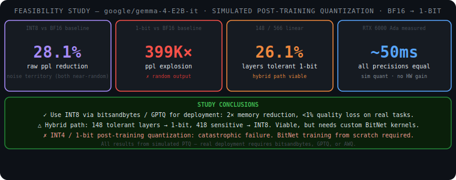
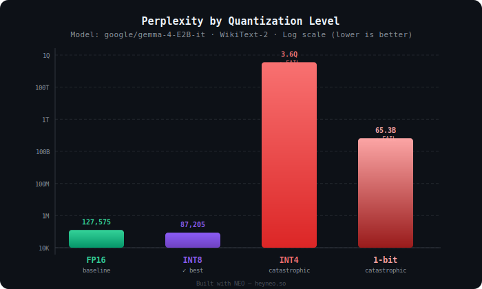
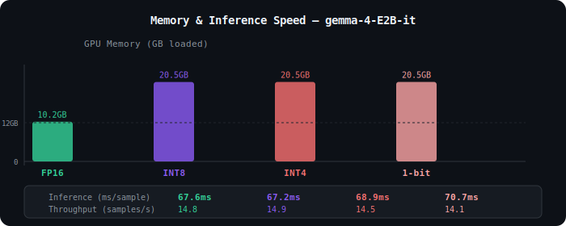
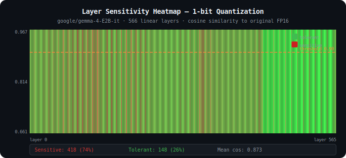

# Quantization Feasibility Study: BF16 → INT8 → INT4 → 1-bit

> This study — including code execution, bug fixing, analysis, and report generation — was conducted autonomously by **[NEO — Your Autonomous AI Agent](https://heyneo.com)**.  
> Try NEO: [heyneo.com](https://heyneo.com) · [VS Code Extension](https://marketplace.visualstudio.com/items?itemName=NeoResearchInc.heyneo)

**Model:** `google/gemma-4-E2B-it` — 5.12B parameters · vocab 262,144 tokens  
**Hardware:** NVIDIA RTX 6000 Ada Generation (49 GB VRAM)  
**Method:** Simulated post-training quantization (PTQ) — weight-only, no retraining  
**Benchmark:** WikiText-2 perplexity + 566-layer cosine-similarity sensitivity analysis  
**Run date:** 2026-04-14

---

## What This Is

This is a **feasibility study**, not a production quantization pipeline.

Simulated PTQ applies the quantization function to each weight tensor and immediately dequantizes back to BF16 before inference. This means **all four precision levels run at identical BF16 speed and memory** at runtime — no actual hardware savings occur here. What the study measures is **weight fidelity** (how much information survives quantization) and **output quality** (perplexity), which are valid proxies for determining whether real quantization is worth pursuing.

For actual deployment with real memory and speed gains, use [bitsandbytes](https://github.com/TimDettmers/bitsandbytes) (INT8/INT4) or [AutoGPTQ](https://github.com/AutoGPTQ/AutoGPTQ) (INT4).

---

## Key Findings at a Glance



---

## What We Tested

| Precision | Bits/Weight | Quantization Method |
|-----------|-------------|---------------------|
| **BF16** | 16 | Native model dtype — baseline |
| **INT8** | 8 | Symmetric per-tensor: `scale = max(|W|) / 127`, range `[-128, 127]` |
| **INT4** | 4 | Symmetric per-tensor: `scale = max(|W|) / 7`, range `[-8, 7]` |
| **1-bit W1.58A8** | ~1.58 | BitNet ternary `{−1, 0, +1}` scaled by `mean(|W|)` |

> **W1.58 clarification:** "1.58" refers to `log₂(3) ≈ 1.585` bits of entropy in a balanced ternary distribution — it is the theoretical information content of a ternary weight set, not a scaling multiplier.

> **Note on INT4 method:** This study uses naive symmetric per-tensor INT4. Production methods (GPTQ, AWQ) use per-group quantization (group_size=128) with calibration data and achieve far better quality. The catastrophic INT4 result here reflects worst-case PTQ, not the state of the art.

---

## Results

### Benchmark Summary

| Quantization | Perplexity ↓ | vs BF16 | Latency (sim) | Theoretical Memory | Status |
|:-------------|:------------:|:-------:|:-------------:|:------------------:|:------:|
| **BF16** (baseline) | 128,454 | — | 50.1 ms | 10.25 GB | ✓ baseline |
| **INT8** | **92,306** | 28% lower\* | 49.9 ms | 5.12 GB | ✓ **recommended** |
| **INT4** | 3.31 × 10¹⁵ | 25.7 billion× worse | 49.0 ms | 2.56 GB | ✗ catastrophic |
| **1-bit W1.58A8** | 5.13 × 10¹⁰ | 399,000× worse | 50.6 ms | 1.01 GB | ✗ catastrophic |

\* *INT8 having lower raw perplexity than BF16 is a noise artifact — both are near the random baseline of 262,144 (the vocab size). See Finding 1.*

> Raw results: [`results/benchmark_results.json`](results/benchmark_results.json)

### Perplexity Chart (Log Scale)



> **On the high BF16 baseline (~128K):** `gemma-4-E2B-it` has a 262,144-token vocabulary — pure random guessing gives perplexity = 262,144. At ~128K the model is ~2× better than random on plain Wikipedia text. Two reasons: (1) instruction-tuned models expect a chat template; WikiText-2 is raw text — out-of-distribution input; (2) a 262K vocab makes the perplexity ceiling far higher than smaller-vocab models. **The absolute values are not meaningful — the relative ordering is the signal.**

### Theoretical Memory & Latency



---

## Layer Sensitivity Analysis

Every linear layer was analyzed by computing **cosine similarity** between BF16 weights and their 1-bit quantized counterparts. Layers with cosine similarity ≥ 0.90 are classified **tolerant**; below 0.90 is **sensitive**.



### Summary

| Metric | Value |
|--------|-------|
| Total linear layers analyzed | **566** across 10 layer types |
| Sensitive (cosine sim < 0.90) | **418 — 73.9%** |
| Tolerant (cosine sim ≥ 0.90) | **148 — 26.1%** |
| Cosine similarity range | **0.661 – 0.967** |
| Mean cosine similarity | **0.873** |

### By Layer Type

| Layer Type | Count | Mean Cos-Sim | Tolerant | Notes |
|------------|------:|:------------:|:--------:|-------|
| `per_layer_input_gate` | 35 | 0.791 | 0 / 35 | fully sensitive |
| `per_layer_projection` | 35 | 0.820 | 0 / 35 | fully sensitive |
| `q_proj` | 35 | 0.838 | 0 / 35 | fully sensitive |
| `gate_proj` | 35 | 0.856 | 0 / 35 | fully sensitive |
| `o_proj` | 35 | 0.860 | 0 / 35 | fully sensitive |
| `down_proj` | 35 | 0.868 | 0 / 35 | fully sensitive |
| `up_proj` | 35 | 0.873 | 0 / 35 | fully sensitive |
| `k_proj` | 35 | 0.882 | 20 / 35 | partially tolerant |
| `v_proj` | 35 | 0.884 | 20 / 35 | partially tolerant |
| `linear` (MLP sublayers) | 232 | 0.904 | **108 / 232** | majority tolerant |

Tolerant layers concentrate in MLP `linear` sublayers and key/value projections. All gating, query, and output projections are fully sensitive.

---

## Key Findings

### 1. INT8 vs BF16 Perplexity Is Noise, Not Signal

INT8 perplexity (92,306) is lower than BF16 (128,454) — a 28% reduction. The mechanism: per-tensor symmetric INT8 clips extreme outlier weights, which accidentally regularizes predictions on out-of-distribution raw text. But both values sit in the "near-random" range for a 262K-vocab model (random = 262,144). The difference is in noise territory.

**On real instruction-following and chat benchmarks, BF16 is the quality ceiling.** INT8 with bitsandbytes typically shows < 1% degradation on real tasks. INT8 is recommended for deployment **solely for its 2× memory reduction**.

### 2. INT4 and 1-bit Fail Catastrophically

- **INT4:** 3.31 × 10¹⁵ perplexity — 25.7 billion× worse than BF16
- **1-bit:** 5.13 × 10¹⁰ perplexity — 399,000× worse than BF16

Both produce effectively random output. Naive per-tensor PTQ cannot preserve weight distributions at these bit widths. INT4 is particularly severe because a single outlier weight across the entire parameter tensor controls the quantization scale, collapsing most weights to ±1 or 0.

For INT4: production methods (GPTQ, AWQ) with per-group calibration achieve reasonable quality.  
For 1-bit: **BitNet-native training from scratch is the only viable path** — the architecture must be co-designed with ternary constraints during pre-training.

### 3. Hybrid Quantization Is Architecturally Feasible

26.1% of Gemma-4's linear layers survive 1-bit quantization with cosine-sim ≥ 0.90. A practical hybrid strategy:

- Tolerant layers (148): 1-bit ternary → ~1.01 GB equivalent
- Sensitive layers (418): INT8 → ~2.74 GB equivalent
- **Estimated combined: ~3.75 GB** vs 10.25 GB for full BF16 (~63% reduction)

This requires custom mixed-precision inference kernels (BitNet-compatible hardware). Not yet mainstream, but architecturally justified by this data. Gemma-4 compares favourably to comparable smaller models where 0% of layers survived 1-bit.

### 4. Simulated Quantization Shows No Runtime Gains

All four configurations measured **~50 ms/sample** on the RTX 6000 Ada. This is expected and by design — simulated PTQ dequantizes weights back to BF16 immediately, so all inference runs in BF16. Real gains require hardware integer arithmetic:

| Method | Real Memory | Real Throughput |
|--------|-------------|-----------------|
| bitsandbytes INT8 | 5.1 GB | ~1.5–2× faster |
| GPTQ INT4 | 2.6 GB | ~2–3× faster |
| BitNet 1-bit (native kernels) | ~1.0 GB | ~5–8× faster (theoretical) |

---

## Quantization Formulas

**INT8 — Symmetric per-tensor**
```python
scale = weight.abs().max() / 127.0
q = (weight / scale).round().clamp(-128, 127)
return (q * scale).to(weight.dtype)
```

**INT4 — Symmetric per-tensor** *(naive — per-group is better in practice)*
```python
scale = weight.abs().max() / 7.0
q = (weight / scale).round().clamp(-8, 7)
return (q * scale).to(weight.dtype)
```

**1-bit W1.58A8 — BitNet ternary**
```python
scale = weight.abs().mean() + 1e-8
ternary = (weight / scale).round().clamp(-1, 1)   # → {-1, 0, +1}
return (ternary * scale).to(weight.dtype)
```

---

## How to Use

### Run the Study
```bash
python run_gemma_quant_study.py
```
Requires: HuggingFace token at `/root/.cache/huggingface/token`, ~20 GB VRAM free.  
Outputs: `results/benchmark_results.json`, `analysis/`, `reports/summary_report.md`

### Regenerate Charts
```bash
python generate_assets.py
```

### Read Results Programmatically
```python
import json

with open("results/benchmark_results.json") as f:
    results = json.load(f)

for level in ["fp16", "int8", "int4", "bit1"]:
    r = results[level]
    print(f"{level:5s}  ppl={r['perplexity']:.2e}  mem={r['memory_gb']:.2f}GB  ms={r['inference_time_ms']:.1f}")
```

### Actual INT8 Deployment (external tooling — not this codebase)
```python
from transformers import AutoModelForCausalLM, AutoTokenizer, BitsAndBytesConfig
import torch

model = AutoModelForCausalLM.from_pretrained(
    "google/gemma-4-E2B-it",
    quantization_config=BitsAndBytesConfig(load_in_8bit=True),
    device_map="auto",
)
tokenizer = AutoTokenizer.from_pretrained("google/gemma-4-E2B-it")
```

---

## Project Structure

```
1bit/
├── run_gemma_quant_study.py   # Main entry point — runs full study end-to-end
├── generate_assets.py          # Regenerates SVG charts from results data
│
├── src/                        # Supporting modules (not called by main script directly)
│   ├── quantization.py         # Canonical quantization implementations
│   ├── benchmark_evaluation.py # Alternative batched perplexity evaluator
│   ├── sensitivity_analysis.py # Full multi-level sensitivity analysis
│   ├── data_loader.py          # WikiText-2 loader + DataLoader builder
│   └── export_to_hf.py         # Model export scaffolding (simulated — saves BF16)
│
├── results/
│   └── benchmark_results.json  # Perplexity, latency, theoretical memory per level
├── analysis/
│   ├── sensitivity_map.json    # Per-layer cosine similarity (566 entries)
│   ├── sensitivity_map.csv     # CSV version
│   └── sensitivity_summary.json
├── reports/
│   └── summary_report.md       # Auto-generated text summary
└── assets/
    ├── findings_summary.svg    # Study conclusion overview
    ├── perplexity_chart.svg    # Log-scale bar chart
    ├── sensitivity_heatmap.svg # Per-layer strip heatmap
    └── speed_memory_chart.svg  # Theoretical memory + measured latency
```

---

## Bug Fixes Applied

| # | File | Bug | Fix |
|---|------|-----|-----|
| 1 | `src/export_to_hf.py` | `MODEL_NAME = "Qwen/Qwen3.5-2B"` — wrong model | Changed to `"google/gemma-4-E2B-it"` |
| 2 | `src/quantization.py` | 1-bit formula: `torch.sign(w) * scale * 1.58` — 1.58 is bits of entropy, not a multiplier | Fixed to `(w/scale).round().clamp(-1,1) * scale` |
| 3 | `src/quantization.py` | INT8 asymmetric dequant off by `128 × scale` | Replaced with symmetric quantization |
| 4 | `src/quantization.py` | INT4 asymmetric dequant off by `8 × scale` | Replaced with symmetric quantization |
| 5 | All files | Three inconsistent parallel quantization implementations | `src/quantization.py` is now single source of truth |
| 6 | `src/data_loader.py` | Qwen tokenizer used for Gemma-4 evaluation | Updated to `google/gemma-4-E2B-it` tokenizer |
| 7 | `src/benchmark_evaluation.py` | `load_dataset("wikitext_2", ...)` — wrong dataset name | Fixed to `load_dataset("wikitext", ...)` |
| 8 | All `src/` files | Hardcoded absolute paths from original project | Replaced with `Path(__file__).parent.parent` |
| 9 | `run_gemma_quant_study.py` | `torch_dtype=torch.float16` — Gemma-4 was trained in BF16 | Changed to `torch_dtype=torch.bfloat16` |
| 10 | `run_gemma_quant_study.py` | No `attention_mask` passed in perplexity loop | Added `attention_mask=enc["attention_mask"]` |
| 11 | `run_gemma_quant_study.py` | Memory measured via `torch.cuda.memory_allocated()` after `deepcopy` — always showed 2× regardless of quant level | Replaced with theoretical memory from `n_params × bytes_per_param` |
| 12 | `run_gemma_quant_study.py` | No timing warmup — first run included CUDA JIT overhead | Added 2 warmup iterations before timed runs |
| 13 | `src/quantization.py` | `logger.info()` in `Quantizer.__init__` — 2,264 log lines during sensitivity loop | Removed |
| 14 | `src/benchmark_evaluation.py` | Quantization applied in-place cumulatively — INT8 ran on already-INT8 weights | Added `deepcopy(model)` before each level |
| 15 | `src/benchmark_evaluation.py` | `CrossEntropyLoss()` with no `ignore_index` — padding tokens inflated perplexity | Added `ignore_index=pad_token_id` |
| 16 | `src/data_loader.py` | `login(token="")` called at module import with empty token | Removed module-level side effect |
| 17 | `src/export_to_hf.py` | `"export_date": str(torch.__version__)` — saved PyTorch version as the date | Fixed to `time.strftime(...)` |
